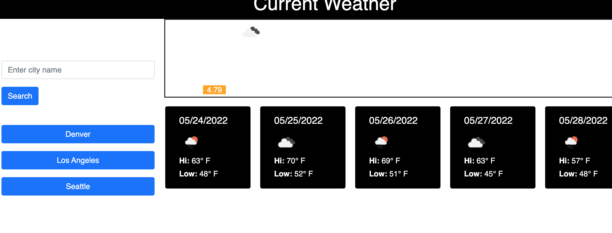

# Weather Dash

## Table of Contents

- [License](#license)
- [Description](#description)
- [Usage](#instructions)
- [Questions](#questions)

## License

## Description

This is an app which allows the user to enter a city location and receive current weather results.

<a href="https://jenya10016.github.io/EmployeeTracker>Click here for github repository</a>

## Usage

## Questions

Send questions to:  
Github: [Jenya Seletsky](https://github.com/Jenya10016)  
Email: js646@me.com  
Phone: 646-244-8249  
